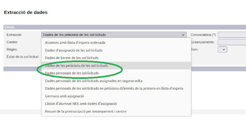
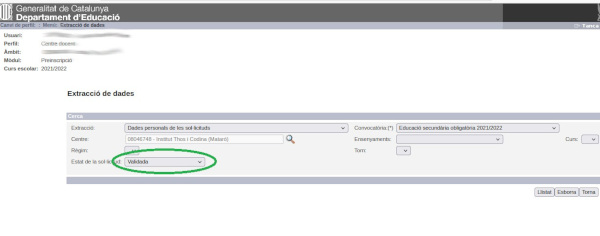
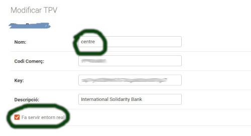
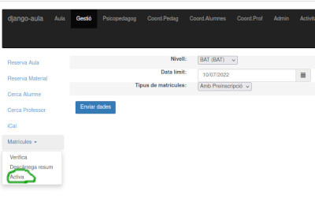
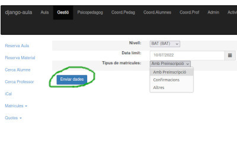
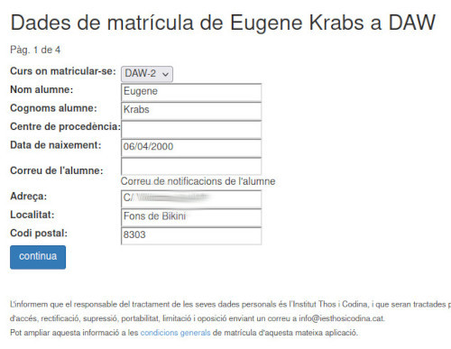
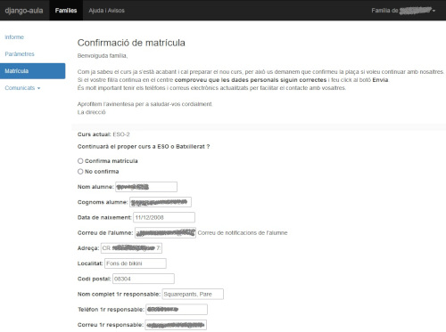
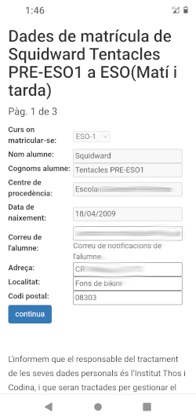
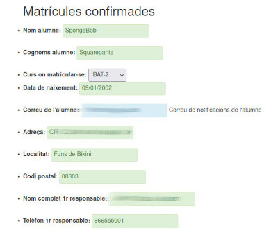
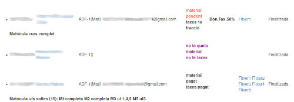

#Matrícula online

##Introducció

El Djau permet realitzar la recollida de dades per a fer la matrícula dels alumnes. Les famílies indiquen la informació necessària i poden fer el pagament de la quota o taxes amb targeta.

Bàsicament hi ha tres tipus de gestió:

Confirmació de matrícula

&nbsp;&nbsp;&nbsp;&nbsp;Es fa servir per a ESO i Batxillerat, les famílies confirmen que volen continuar.

Matrícula nova segons preinscripció

&nbsp;&nbsp;&nbsp;&nbsp;Per als casos d’alumnes nous que han hagut de fer preinscripció.

Matrícula de continuïtat  sense preinscripció

&nbsp;&nbsp;&nbsp;&nbsp;Per a alumnes actuals de cicles què continuen els seus estudis.

Aquest mecanisme no substitueix la matrícula de Saga i Esfera.

L'objectiu principal és realitzar els tràmits de matrícula de manera online i que el Djau ja tingui totes les dades per iniciar el següent curs acadèmic.

Aquest mòdul farà servir [Quotes](quotes.md) i, en finalitzar la matrícula, s'haurà [d'inicialitzar](inicialitza.md) la base de dades. No serveix si s'esborra la base de dades i es comença des de zero al setembre.

##Importació de dades

Les dades de preinscripció s’obtenen del gedac, han d’importar-se al Djau.

S'haurà d'importar a mesura que es van creant, segons el nivell educatiu s'obtenen en dates diferents.

Des de Menú del gedac es selecciona Extracció de dades


A continuació s’ha d’escollir tipus d’extracció i convocatòria. Són dos fitxers per cada convocatòria (nivell educatiu).

Tipus d’extracció què necessitem:

* Dades de les peticions de les sol·licituds
* Dades personals de les sol·licituds




L’estat ha de ser Validada.



Els fitxers obtinguts s’han d’importar al Djau des de l’opció Admin / Sincronitza / Preinscripció.

##Configuració

###Variables CUSTOM:

CUSTOM_MODUL_MATRICULA_ACTIU = True

Codi de centre que apareix a les preinscripcions:

CODI_CENTRE = u"nnnnnnnn"

Document amb les condicions de matrícula, permet incloure codi html.:

CONDICIONS_MATRICULA = location( r'../customising/docs/MATRICULA' )

Si s’ha de fer algun pagament:

CUSTOM_SORTIDES_PAGAMENT_ONLINE = True

CUSTOM_SORTIDES_PAGAMENT_CAIXER = False

CUSTOM_QUOTES_ACTIVES = True


Documents necessaris per al pagament online i la protecció de dades

DADES_FISCALS_FILE = location( r'../customising/docs/DADESFISCALS' )

POLITICA_VENDA_FILE = location( r'../customising/docs/POLITICAVENDA' )

POLITICA_COOKIES = location( r'../customising/docs/POLITICACOOKIES' )

POLITICA_RGPD = location( r'../customising/docs/POLITICARGPD' )

INFORGPD = location( r'../customising/docs/INFORGPD' )

INFORGPD és l'avís sobre el tractament de dades personals, ha de mostrar-se a cada pantalla que capti dades. Aquest fitxer permet codi html.

Exemple d'INFORGPD:

```html
<small>L'informem que el responsable del tractament de les seves dades personals és l’Institut .............., i que seran tractades per gestionar el procés de matriculació. Pot exercir els drets d'accés, rectificació, supressió, portabilitat, limitació i oposició enviant un correu a dpd@institut.org.<br>Pot ampliar aquesta informació a les <a href="/matricula/condicions" target="_blank">condicions generals</a> de matrícula d'aquesta mateixa aplicació.</small>
```

Mida màxima (bytes) dels fitxers que es poden pujar en la web:

FILE_UPLOAD_MAX_MEMORY_SIZE=20971520

DATA_UPLOAD_MAX_MEMORY_SIZE=20971520

Dades del TPV per al pagament:

CUSTOM_CODI_COMERÇ='XXXXXXXX’'

CUSTOM_KEY_COMERÇ='xnxnxnxnxnxnxnxnxnxnxnxnxnxnxnxnxnxnx’'

CUSTOM_REDSYS_ENTORN_REAL = True

També es pot fer la configuració del TPV a la base de dades.
Des de les opcions d’administració de django, URL_DJANGO_AULA/admin




Es poden definir diversos TPV. El principal ha de ser ‘centre’.

Si es volen fer els pagaments necessaris pel Djau, s’han de definir les quotes necessàries, material, taxes...:


El tipus de quota utilitzat a la matrícula es defineix als settings, per exemple:

CUSTOM_TIPUS_QUOTA_MATRICULA = 'material'

En el moment de fer la matrícula, s'assigna automàticament una quota del tipus indicat segons el curs i any. Si no existeix CUSTOM_TIPUS_QUOTA_MATRICULA, es pot assignar posteriorment la quota que correspongui a cada alumne tam com s'explica a [Quotes](quotes.md).

Els tipus i les quotes han de crear-se des de /admin.

Exemple:

```text
import any  descripció      tipus    curs  data_límit
  40  2021  Material 1r ESO material ESO-1 15/7/2021
  50  2021  Material 1r BAT material BAT-1 15/7/2021
```

Quotes especials taxes de cicles:

tipus quota '**uf**' indica taxa per uf individual

tipus quota '**taxcurs**' indica taxa per curs complet.

Si es vol fer el pagament online de les taxes de grau superior, s'han de definir una quota de cada tipus.

Exemple:

```text
import any  descripció      tipus    curs
  25  2021  Preu UF         uf       sense curs
 360  2021  Taxes cicles FP taxcurs  sense curs
```

A cada nivell de cicles s'ha de definir el tipus de quota per a la taxa, es pot fer diferent per a cada nivell, però el més habitual és que sigui el mateix tipus per a tots els nivells. A la taula alumnes_nivell s'indica quin tipus de quota es fa servir per a les taxes. Si no s'aplica cap taxa, com per exemple a grau mitjà, aleshores s'ha de deixar en blanc. Aquest camp es modifica des de /admin.

Exemple: tipus 'taxes'

El Djau calcularà automàticament l'import segons la quantitat d'UFs i les quotes '**uf**' i '**taxcurs**' definides. Si amb UFs soltes, l'import supera el màxim, aleshores assigna la taxa de curs complet. Es creen automàticament les quotes necessàries del tipus.

##Activació i seguiment
###Inici de la matrícula
Una vegada tot preparat es pot iniciar la matrícula:

L'administrador del Djau executa procés inicial, que envia emails als alumnes preinscrits, des de Gestió / Matrícules / Activa.

Se selecciona nivell educatiu, data límit i tipus de matrícula.
L’alumne o la família rep un email amb les instruccions.

Aquest procés crea un usuari per a cada alumne (si fa falta).
Es fa per nivells, es poden fer en dates diferents.
Les famílies confirmen les dades i fan els pagaments.

Es revisa tot per part de secretaria, des de Gestió / Matrícules.

Tipus de matrícula:

Preinscripció: per alumnes nous.

Confirmacions: per alumnes actuals d’ESO i Batxillerat.

Altres: per alumnes actuals d’altres nivells educatius.



###Entrada o revisió de dades per part de la família
Opcions al portal de famílies:

Matrícula - per omplir les dades mentre no estigui la matrícula finalitzada.

Activitats/Pagaments - permet fer els pagaments de les quotes o taxes.

L'entrada de dades varia en funció del tipus de matrícula.

####Matrícula amb preinscripció. 

Demana les dades en diverses pantalles.



####Confirmació
Bàsicament es tracta de fer la confirmació i revisió de les dades de contacte.



####Altres
Similar a la matrícula amb preinscripció. En aquest exemple es pot veure l’aspecte des d’un smartphone.



###Revisió de les matrícules des del centre
Es revisa tot per part de secretaria, des de Gestió / Matrícules / Verifica.

Les confirmacions mostren en verd les dades confirmades i en blau les modificades.

S’ha de validar el curs de la matrícula, per defecte es proposa el curs següent, però si l’alumne repeteix, s’ha de modificar. Al finalitzar, la família rep un missatge de confirmació.



Les altres matrícules apareixen en llistat, s’indica les dades de contacte, l’estat dels pagaments de quota o taxes i els documents que s’han aportat. Si tot és correcte es poden finalitzar i la família rep un missatge de confirmació.


